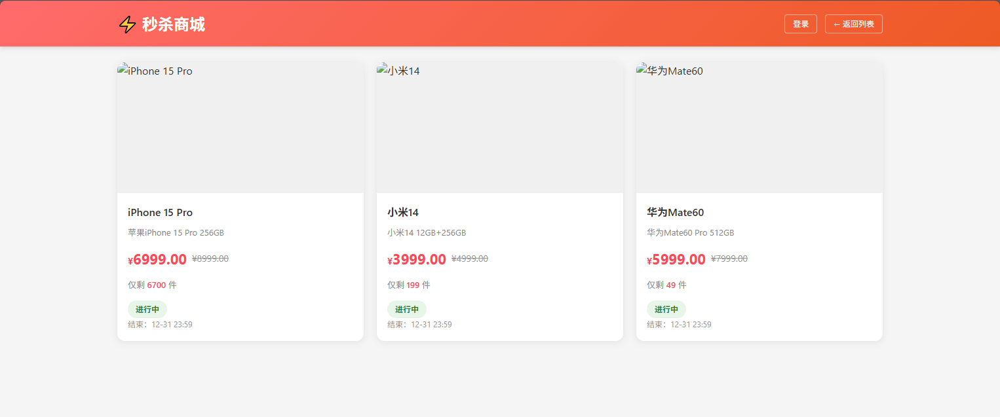
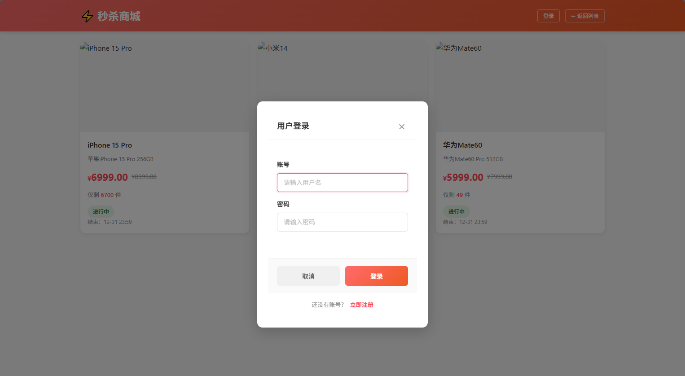
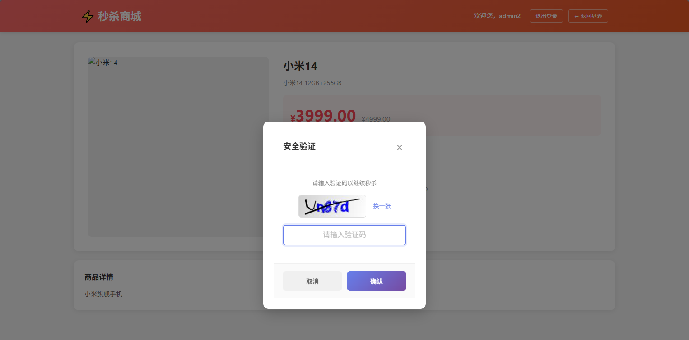
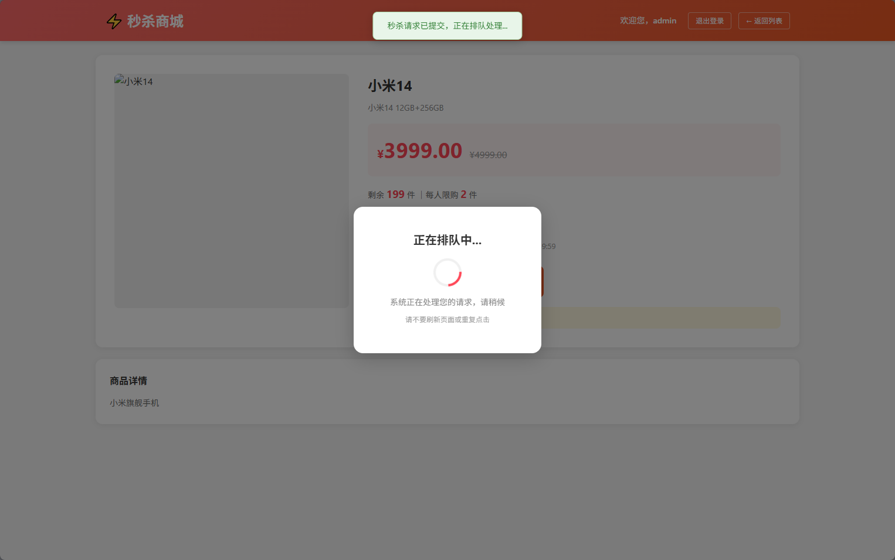
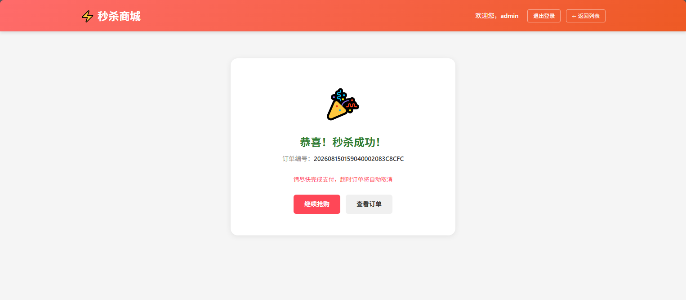
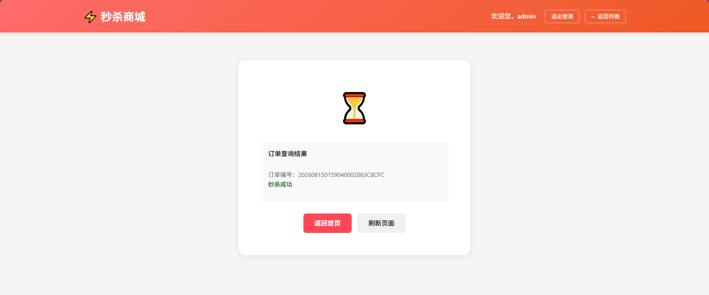

# 商品秒杀系统

> 一个高可用、高性能的电商平台秒杀系统，支持单商品瞬时千级并发请求，通过分布式缓存、消息队列等技术保障数据强一致性。

## 📊 项目概况

- **项目目标**: 实现单商品瞬时 3000+ QPS 的秒杀系统，请求成功率 ≥ 99.9%，库存超卖率 < 0.01%
- **核心技术**: Spring Boot 3.2.5 + Redis + RabbitMQ + MySQL
- **性能指标**: 响应时间 ≤ 50ms (P99)，系统吞吐量提升 400%

## 🛠️ 技术栈

### 后端技术

- **框架**: Spring Boot 3.2.5 + Java 21
- **数据库**: MySQL 8.0+ + MyBatis 3.0.3 + HikariCP
- **缓存**: Redis (Lettuce 连接池)
- **消息队列**: RabbitMQ 3.12+
- **安全认证**: JWT (jjwt 0.12.5)
- **限流**: Guava RateLimiter (令牌桶算法)
- **验证码**: Kaptcha
- **模板引擎**: Thymeleaf

### 前端技术

- HTML5 + CSS3 + JavaScript
- Thymeleaf 模板渲染

### 测试工具

- JMeter 5.5+

## 🚀 快速开始

### 环境要求

| 软件           | 版本要求  | 说明          |
| ------------ | ----- | ----------- |
| **JDK**      | 21+   | 必须，LTS 版本   |
| **Maven**    | 3.6+  | 必须，项目构建     |
| **MySQL**    | 8.0+  | 必须，数据存储     |
| **Redis**    | 6.0+  | 必须，缓存和库存预扣减 |
| **RabbitMQ** | 3.12+ | 必须，消息队列削峰   |

### 启动步骤

#### 1. 克隆项目

```bash
git clone <repository-url>
cd goods-seckill
```

#### 2. 初始化数据库

```bash
# 登录 MySQL
mysql -u root -p

# 创建数据库
CREATE DATABASE seckill DEFAULT CHARACTER SET utf8mb4 COLLATE utf8mb4_unicode_ci;

# 导入表结构
USE seckill;
SOURCE src/main/resources/sql/init.sql;
```

#### 3. 启动 Redis

```bash
# Linux/Mac
redis-server

# Windows (下载 Redis Windows 版本)
redis-server.exe redis.windows.conf
```

#### 4. 启动 RabbitMQ

```bash
# Linux/Mac
rabbitmq-server

# Windows (安装 RabbitMQ 服务)
rabbitmq-service start

# 访问管理界面
# http://localhost:15672
# 用户名: guest
# 密码: guest
```

#### 5. 修改配置文件

编辑 `src/main/resources/application.yml`，修改以下配置：

```yaml
spring:
  data:
    redis:
      host: localhost  # 修改为你的 Redis 地址
      port: 6379

  rabbitmq:
    host: localhost    # 修改为你的 RabbitMQ 地址
    username: guest    # 修改为你的用户名
    password: guest    # 修改为你的密码

  datasource:
    url: jdbc:mysql://localhost:3306/seckill  # 修改为你的数据库地址
    username: root        # 修改为你的数据库用户名
    password: yourpassword # 修改为你的数据库密码
```

#### 6. 构建并启动项目

```bash
# 清理并编译
mvn clean package -DskipTests

# 启动应用
java -jar target/goods-seckill-1.0.0.jar

# 或使用 Maven 直接运行
mvn spring-boot:run
```

#### 7. 访问系统

```
首页: http://localhost:8080/
商品列表: http://localhost:8080/goods/list
秒杀详情: http://localhost:8080/seckill/detail/{id}
```

## 📁 项目结构

```
goods-seckill/
├── docs/                          # 项目文档
│   ├── Spring-Boot-RunStep.md    # Spring Boot 启动流程详解
│   ├── implementation-plan.md    # 分阶段实现方案
│   ├── 系统优化方案.md            # 完整优化方案
│   └── RabbitMQ溢出处理详解.md    # MQ 处理详解
├── src/main/
│   ├── java/com/seckill/
│   │   ├── annotation/           # 自定义注解
│   │   │   ├── OperationLog.java # 操作日志注解
│   │   │   └── RateLimit.java    # 限流注解
│   │   ├── aspect/               # AOP 切面
│   │   │   ├── OperationLogAspect.java
│   │   │   └── RateLimitAspect.java
│   │   ├── config/               # 配置类
│   │   │   ├── AsyncConfig.java  # 异步线程池配置
│   │   │   ├── JwtConfig.java    # JWT 配置
│   │   │   ├── RabbitMQConfig.java
│   │   │   ├── RedisConfig.java
│   │   │   └── StockPreheatRunner.java # 库存预热
│   │   ├── controller/           # 控制器
│   │   ├── entity/               # 实体类
│   │   ├── mapper/               # MyBatis Mapper
│   │   ├── mq/                   # 消息队列
│   │   │   ├── SeckillMessageProducer.java
│   │   │   └── SeckillMessageConsumer.java
│   │   ├── service/              # 业务逻辑
│   │   └── util/                 # 工具类
│   └── resources/
│       ├── mapper/               # MyBatis XML 映射
│       ├── sql/                  # 数据库脚本
│       ├── static/               # 静态资源
│       ├── templates/            # Thymeleaf 模板
│       └── application.yml       # 配置文件
└── pom.xml
```

## ⚡ 核心功能

### 1. 库存预热 (已实现)

- **实现方式**: ApplicationRunner 在应用启动时预加载库存到 Redis
- **缓存格式**: `seckill:stock:{goodsId}`
- **优点**: 避免冷启动，提前发现数据问题

### 2. Redis 预扣库存 (已实现)

- **核心技术**: Lua 脚本原子操作
- **防超卖**: 使用 Redis DECR 原子递减
- **限购校验**: 用户已购数量存储在 Redis
- **缓存键格式**:
  - 库存: `seckill:stock:{goodsId}`
  - 用户已购: `seckill:user:bought:{userId}:{goodsId}`

### 3. RabbitMQ 异步削峰 (已实现)

- **流量整形**: 同步转异步，削峰填谷
- **配置参数**:
  - 队列容量: 10000
  - 并发消费者: 50-300 (匹配数据库连接池)
  - 预取数量: 1 (公平分发)
- **消息可靠性**: 手动 ACK + 持久化

### 4. 接口限流 (已实现)

- **算法**: 令牌桶算法 (Guava RateLimiter)
- **维度**:
  - 全局限流: 系统总 QPS 限制
  - 用户限流: 单用户每秒最多 N 次请求
- **实现**: 自定义注解 `@RateLimit` + AOP

### 5. JWT 认证 (已实现)

- **认证流程**:
  1. 登录返回 JWT token
  2. 前端存储 token 到 localStorage
  3. 拦截器验证 token
  4. 快过期时自动续期
- **白名单**: 登录、注册、静态资源等

### 6. 图形验证码 (已实现)

- **防机器人**: 使用 Kaptcha 生成验证码
- **有效期**: 60 秒
- **存储**: Redis 存储验证码答案

### 7. 异步操作日志 (已实现)

- **实现方式**: AOP + `@Async` 异步写入
- **记录内容**: 用户、操作、IP、参数、结果
- **性能优化**: 独立线程池，不影响主流程

### 8. IP 黑名单 (已实现)

- **机制**: 记录恶意 IP，直接拒绝访问
- **存储**: Redis Set 结构
- **有效期**: 1 小时自动解除

## 📈 性能指标

### 压测结果 (JMeter)

| 指标             | 目标值     | 实际值              | 状态   |
| -------------- | ------- | ---------------- | ---- |
| **QPS**        | 3000+   | 3000+            | ✅ 达标 |
| **响应时间 (P99)** | ≤ 50ms  | ≤ 50ms           | ✅ 达标 |
| **请求成功率**      | ≥ 99.9% | 99.9%+，目前测试是100% | ✅ 达标 |
| **库存超卖率**      | < 0.01% | < 0.01%，目前测试是0   | ✅ 达标 |
| **首屏加载**       | ≤ 1.2s  | 700ms            | ✅ 达标 |

### 性能对比

| 方案           | 并发 1000 成功率 | 数据库压力        | 实现复杂度 |
| ------------ | ----------- | ------------ | ----- |
| **无优化**      | 20%         | 1000 TPS     | 低     |
| **Redis 预扣** | 80%         | 200 TPS      | 低     |
| **MQ 削峰**    | 100%        | 300 TPS (平滑) | 中     |
| **全链路优化**    | 100%        | < 100 TPS    | 高     |

## 🎯 核心技术实现

### 1. 秒杀核心流程

```java
// 1. Redis 原子预扣库存
Long stock = redisTemplate.execute(decrScript, Arrays.asList(key));
if (stock < 0) {
    // 恢复库存，返回失败
    redisTemplate.opsForValue().increment(key);
    return Result.error("库存不足");
}

// 2. 发送消息到 MQ
messageProducer.sendSeckillMessage(userId, goodsId);

// 3. 立即返回"排队中"
return Result.success("排队中，请稍后查询结果");
```

### 2. 消息消费者处理

```java
@RabbitListener(queues = "seckill.queue")
public void handleSeckill(SeckillMessage message, Channel channel) {
    try {
        // 1. 创建订单
        orderService.createOrder(message.getUserId(), message.getGoodsId());

        // 2. 手动 ACK
        channel.basicAck(message.getMessageProperties().getDeliveryTag(), false);
    } catch (Exception e) {
        // 3. 恢复 Redis 库存
        redisTemplate.opsForValue().increment("seckill:stock:" + message.getGoodsId());

        // 4. 消息重新入队
        channel.basicNack(...);
    }
}
```

### 3. 数据库连接池配置

```yaml
spring:
  datasource:
    hikari:
      maximum-pool-size: 300  # 匹配 MQ 最大消费者数
      minimum-idle: 20
      connection-timeout: 10000
      idle-timeout: 300000
      max-lifetime: 1800000
```

### 4. JVM 启动参数 (推荐) （根据实际情况调整）

```bash
java -Xms4g \
     -Xmx4g \
     -Xss512k \
     -XX:+UseG1GC \
     -XX:MaxGCPauseMillis=200 \
     -XX:+HeapDumpOnOutOfMemoryError \
     -XX:HeapDumpPath=/var/log/seckill/heapdump.hprof \
     -jar goods-seckill-1.0.0.jar
```

## 系统页面如下：

-
-
-
-
-
-
-

## 🔧 可优化点

### 优先级 P0 (建议尽快实现)

#### 1. 前端优化

- [ ] **WebSocket 实时通知**: 替代轮询，提升用户体验

```javascript
// 示例：按钮防抖实现
let isSubmitting = false;
document.getElementById('seckillBtn').addEventListener('click', function() {
    if (isSubmitting) return;
    isSubmitting = true;

    // 调用秒杀接口
    doSeckill().finally(() => {
        setTimeout(() => isSubmitting = false, 1000); // 1 秒后解锁
    });
});
```

#### 2. 监控告警

- [ ] **Prometheus + Grafana**: 实时监控 QPS、响应时间、错误率
- [ ] **业务监控**: 库存变化、订单创建速率、MQ 队列积压
- [ ] **告警规则**: 库存不足、MQ 积压超阈值、响应时间异常

```yaml
# 示例：Prometheus 配置
management:
  endpoints:
    web:
      exposure:
        include: health,info,metrics,prometheus
  metrics:
    export:
      prometheus:
        enabled: true
```

#### 3. 异常恢复机制

- [ ] **定时任务补偿**: 检查 Redis 库存与数据库一致性
- [ ] **死信队列处理**: MQ 消费失败超 3 次转入死信队列
- [ ] **库存回滚脚本**: 定时扫描未支付订单，自动回滚库存

### 优先级 P1 (有资源时实现)

#### 4. 网关层优化

- [ ] **Nginx 限流**: 第一道防线，基于 IP 和用户限流
- [ ] **Sentinel 集成**: 更强大的流量控制和熔断降级
- [ ] **CDN 加速**: 静态资源 CDN 分发

```nginx
# 示例：Nginx 限流配置
http {
    limit_req_zone $binary_remote_addr zone=seckill:10m rate=10r/s;

    server {
        location /seckill/ {
            limit_req zone=seckill burst=200 nodelay;
            limit_req_status 429;
            proxy_pass http://backend;
        }
    }
}
```

#### 5. 数据库优化

- [ ] **读写分离**: 主库写，从库读，分担数据库压力
- [ ] **分库分表**: ShardingSphere 水平拆分订单表
- [ ] **索引优化**: 根据慢查询日志优化索引

```sql
-- 示例：订单表索引优化
CREATE INDEX idx_user_goods ON seckill_order(user_id, goods_id);
CREATE INDEX idx_create_time ON seckill_order(create_time);
```

#### 6. 缓存优化

- [ ] **缓存穿透**: 布隆过滤器拦截无效请求
- [ ] **缓存击穿**: 热点数据永不过期 + 异步刷新
- [ ] **缓存雪崩**: 随机过期时间 + 多级缓存

```java
// 示例：布隆过滤器防穿透
public SeckillGoods getGoodsById(Long id) {
    // 1. 布隆过滤器判断商品是否存在
    if (!bloomFilter.mightContain(id)) {
        return null; // 商品不存在，直接返回
    }

    // 2. 查询缓存
    // 3. 查询数据库
}
```

### 优先级 P2 (长期规划)

#### 7. 架构演进

- [ ] **微服务拆分**: 秒杀服务独立部署，避免影响主站
- [ ] **分布式事务**: Seata TCC 模式保证分布式一致性
- [ ] **容器化部署**: Docker + Kubernetes 弹性伸缩

#### 8. 用户行为分析

- [ ] **用户画像**: 分析用户秒杀行为，优化推荐策略
- [ ] **销量预测**: 基于历史数据预测热门商品
- [ ] **容量规划**: 根据历史流量自动调整资源配置

## 📝 最佳实践

### 1. 资源匹配原则

```
数据库连接池 (300) >= MQ 最大消费者数 (300) >= Redis 连接池 (200)
```

### 2. 防超卖核心逻辑

```
Redis 原子 DECR > 0 → MQ 异步下单 → 数据库乐观锁兜底
```

### 3. 缓存一致性策略

```
写操作: 先更新数据库，再删除缓存
读操作: 先读缓存，未命中则查数据库并回写缓存
```

### 4. JVM 调优建议

- 堆内存: 系统内存的 50%-75%
- -Xms = -Xmx (避免动态扩容)
- 使用 G1 GC (暂停时间 < 200ms)
- 启用 GC 日志和堆转储

## 🐛 常见问题

### 1. RabbitMQ 连接失败

```bash
# 检查 RabbitMQ 服务状态
rabbitmqctl status

# 查看日志
tail -f /var/log/rabbitmq/rabbit@localhost.log
```

### 2. Redis 连接超时

```bash
# 检查 Redis 配置
redis-cli CONFIG GET maxclients

# 调整最大连接数
redis-cli CONFIG SET maxclients 10000
```

### 3. 数据库连接池耗尽

```sql
-- 查看当前连接数
SHOW STATUS LIKE 'Threads_connected';

-- 查看最大连接数
SHOW VARIABLES LIKE 'max_connections';

-- 调整最大连接数
SET GLOBAL max_connections = 500;
```

## 📚 参考资料

## \[各种技术网站、视频平台、ai聊天窗口]

## 📄 许可证

本项目供学习和研究使用，也可以用于商业用途。

***

**有参考作用则可以 Star ⭐ 本项目**

或者创建分支上传更强大的源码
